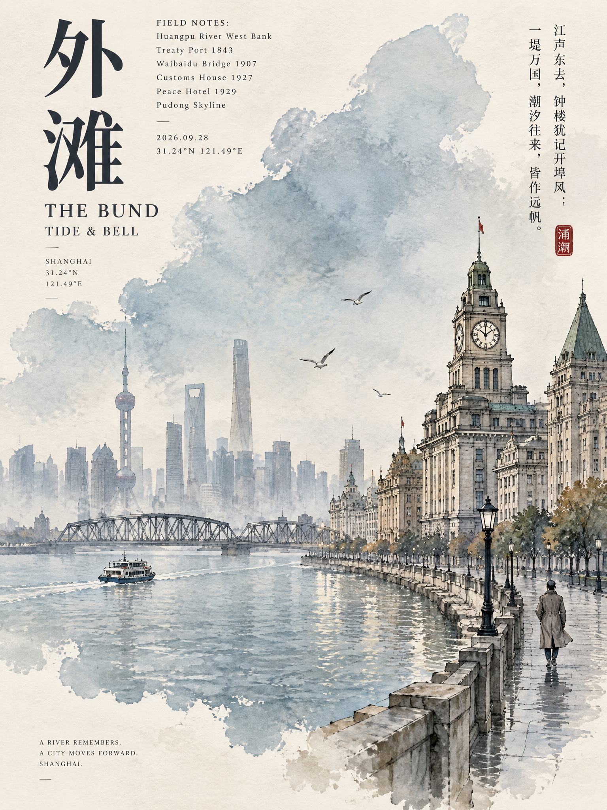
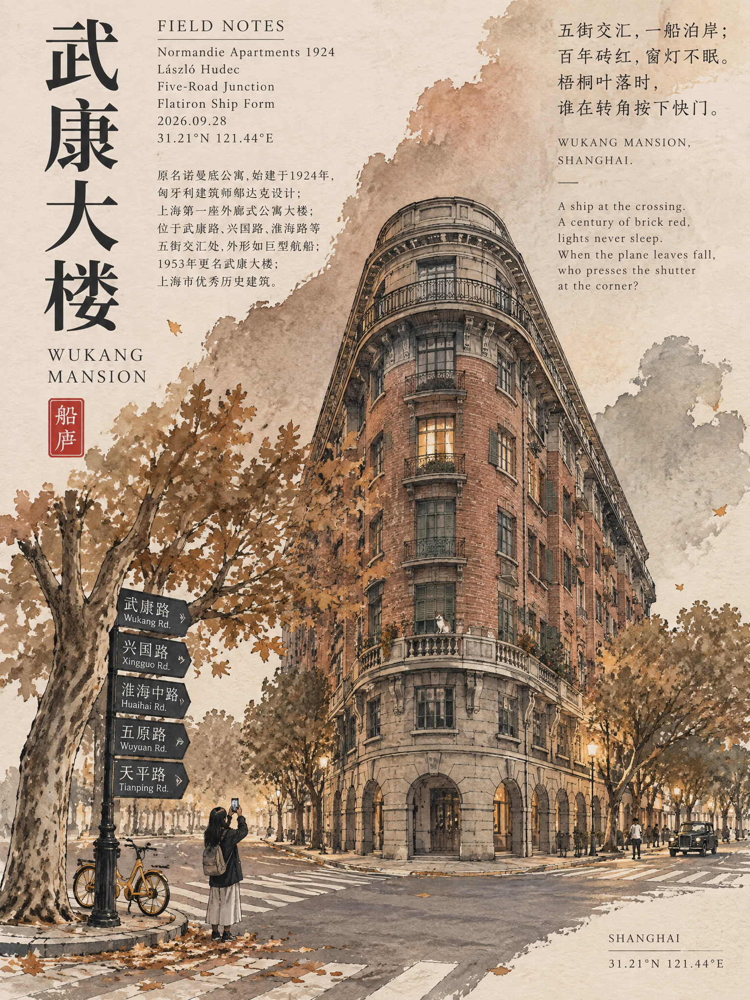
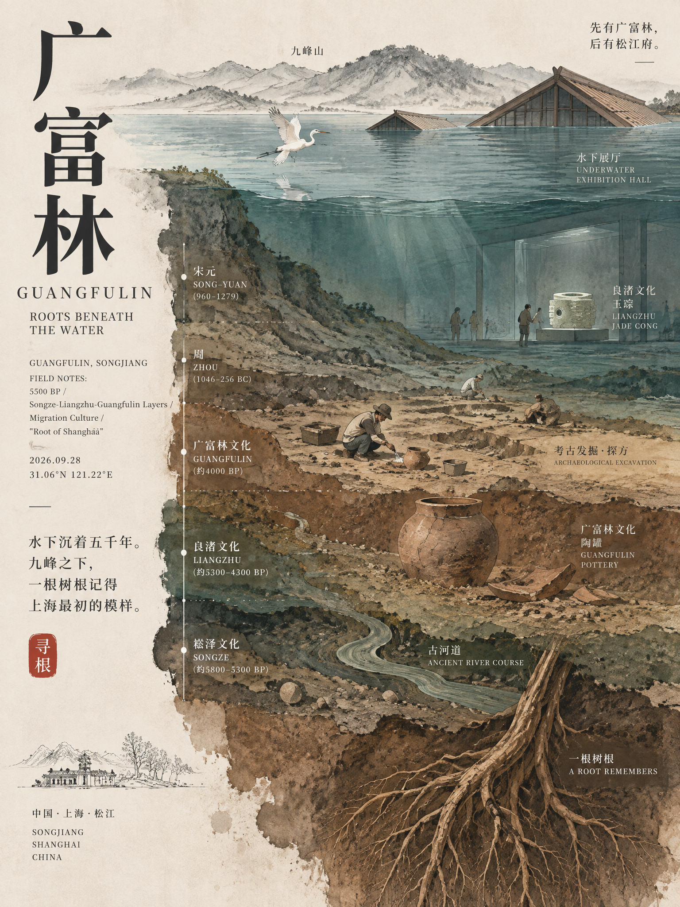
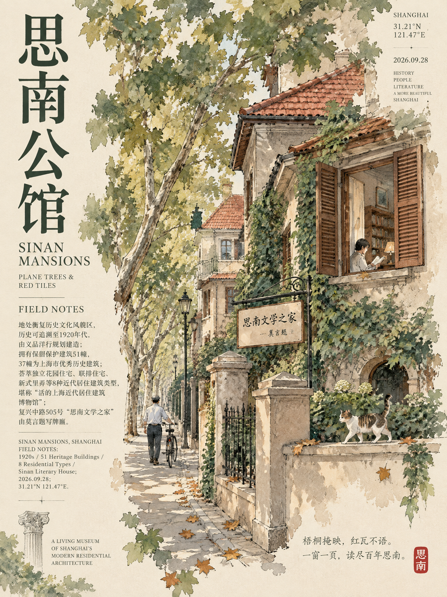
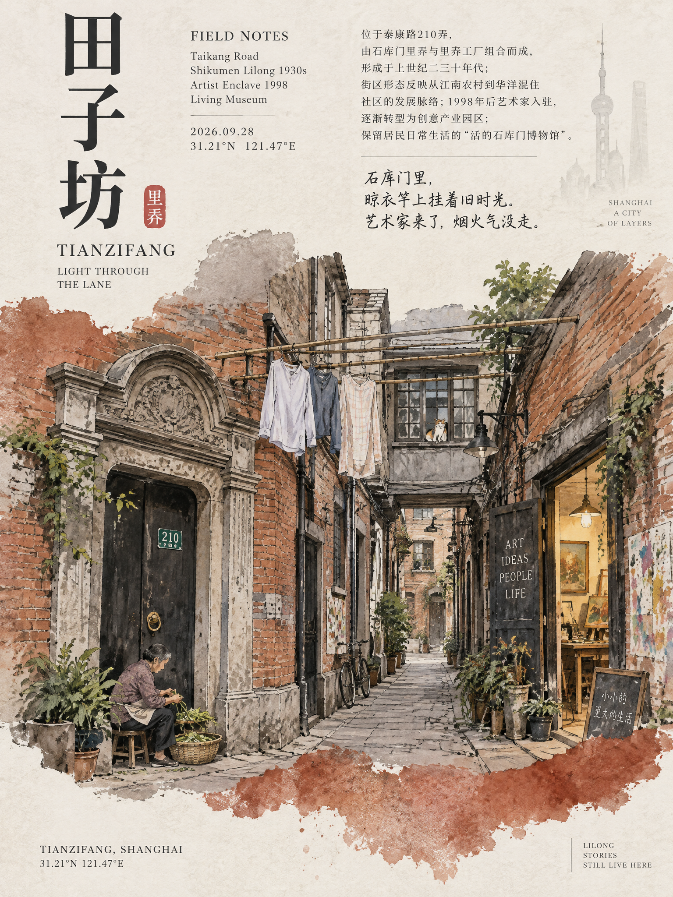
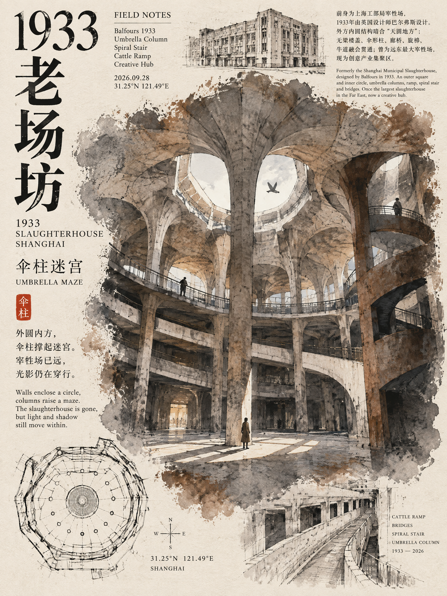

<div align="center">

# 城市景点极简艺术海报生成器

**把城市地标与文旅意象，转化为一组极简、雅致的竖版艺术海报。**

面向已接入图像生成工具的 Agent。描述一个城市，即可直接生成海报图片。

[查看 Skill](SKILL.md) · [安装方式](#安装) · [作品示例](#作品示例)

</div>

---

## 作品示例

以下示例展示不同城市景点如何转化为一套统一而各具特色的海报视觉。

<table>
  <tr>
    <td align="center" width="50%">
      <strong>豫园 · 园林叠石与曲水</strong><br><br>
      
    </td>
    <td align="center" width="50%">
      <strong>朱家角 · 石桥与水巷</strong><br><br>
      
    </td>
  </tr>
  <tr>
    <td align="center" width="50%">
      <strong>外滩 · 江岸钟楼与城市天际线</strong><br><br>
      
    </td>
    <td align="center" width="50%">
      <strong>武康大楼 · 梧桐街角与海派建筑</strong><br><br>
      
    </td>
  </tr>
  <tr>
    <td align="center" width="50%">
      <strong>广富林 · 水下展厅与文化根脉</strong><br><br>
      
    </td>
    <td align="center" width="50%">
      <strong>思南公馆 · 石库门与静巷</strong><br><br>
      
    </td>
  </tr>
  <tr>
    <td align="center" width="50%">
      <strong>田子坊 · 里弄转角与生活肌理</strong><br><br>
      
    </td>
    <td align="center" width="50%">
      <strong>1933 老场坊 · 混凝土回廊与旧工业空间</strong><br><br>
      
    </td>
  </tr>
</table>

## 安装

### TRAE 全局安装（Windows）

在 PowerShell 执行：

```powershell
New-Item -ItemType Directory -Force "$env:USERPROFILE\.trae\skills" | Out-Null
git clone https://github.com/robinshen84/city-landmark-minimal-poster.git "$env:USERPROFILE\.trae\skills\city-landmark-minimal-poster"
```

安装后刷新或重启 Agent。

### 安装到当前项目

在项目根目录执行：

```powershell
New-Item -ItemType Directory -Force ".trae\skills" | Out-Null
git clone https://github.com/robinshen84/city-landmark-minimal-poster.git ".trae\skills\city-landmark-minimal-poster"
```

其他 Agent 可将仓库克隆到其支持的 Skills 目录。

## 使用

安装后可以直接输入城市名，或指定城市和数量，例如：

```text
上海
生成成都前 3 个景点的海报
```

Skill 默认每批处理 9 个景点；也可以指定数量。默认工作方式是调用 Agent 当前可用的图像生成工具并返回图片，不把完整提示词作为结果。Image 2.5、即梦、豆包等服务能否调用，取决于所在 Agent 是否已接入相应工具和权限。

如果当前 Agent 没有图像生成工具，Skill 会说明无法直接生成，不会谎称已出图，也不会默认只用提示词替代图片。
